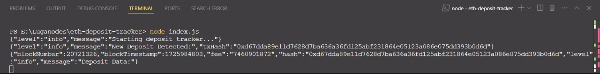

# Ethereum Deposit Tracker

## Overview

The Ethereum Deposit Tracker monitors and records ETH deposits on the Beacon Deposit Contract. It uses the Ethereum RPC methods to interact with the blockchain and track incoming deposits.

## Features

- Real-time tracking of deposits on the Beacon Deposit Contract.
- Logs deposit details such as amount, sender address, and timestamp.
- Optional Telegram notifications for new deposits.

## Setup

### Prerequisites

- Node.js (version 16 or later)
- Alchemy/Infura API Key

## Telegram Alert

## Console Output

